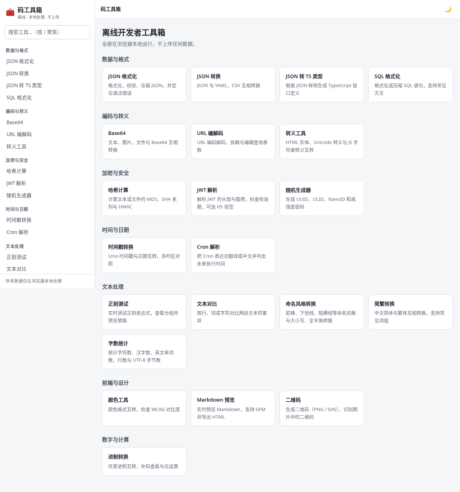
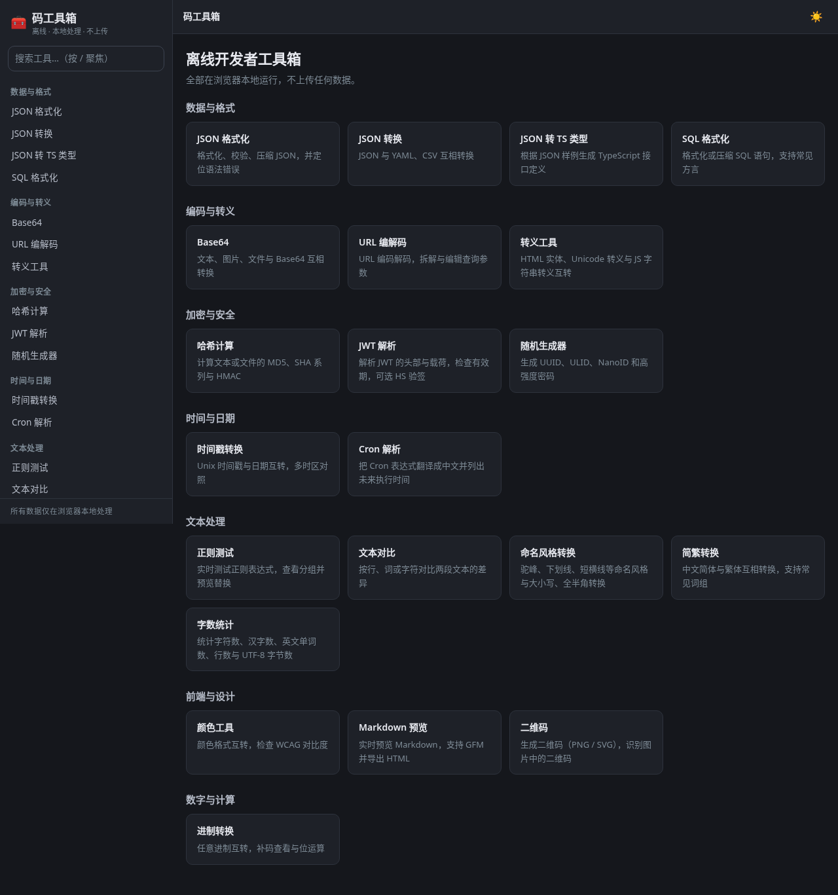
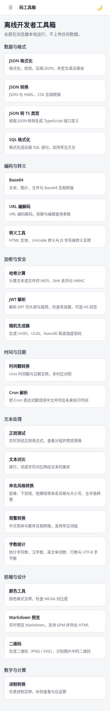
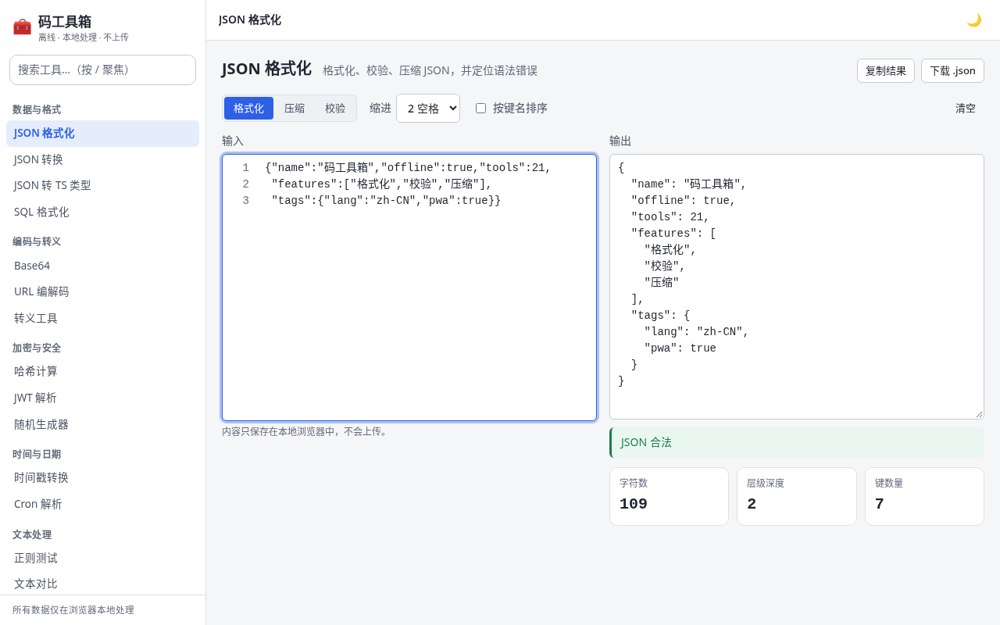
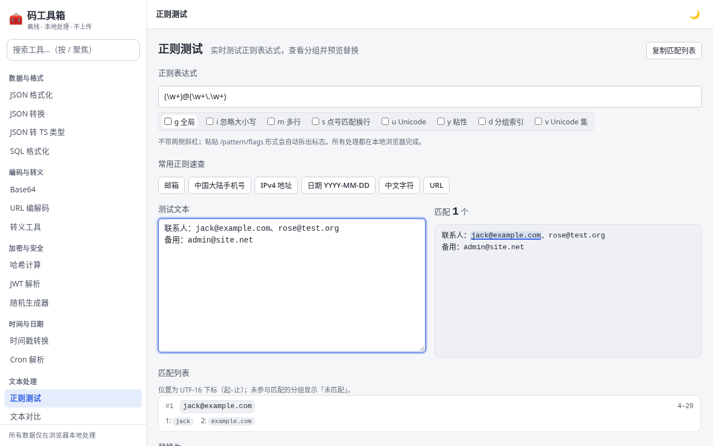
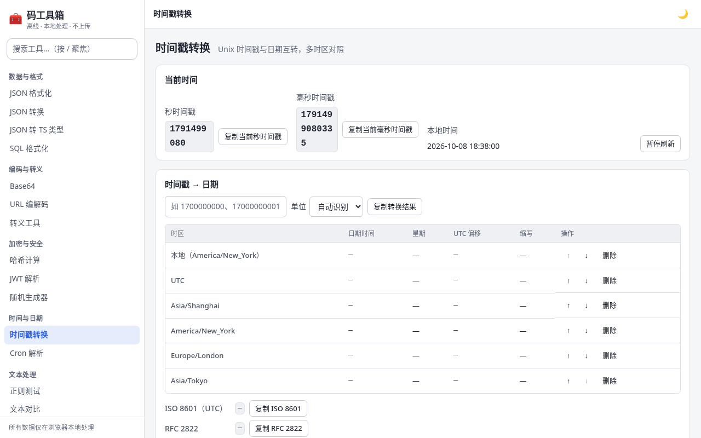

# 码工具箱

纯前端、完全离线可用的中文开发者工具合集 —— 打开即用、全中文界面，所有数据只在浏览器本地处理（不上传、不发任何外部请求）。

**在线使用：<https://jackeyhan-jh.github.io/glm-toolbox/>**

首次访问后即可断网使用（PWA 离线缓存），也可在 Chrome 中「安装」为独立应用。

## 截图

| 首页（浅色） | 首页（深色） | 手机（375×667） |
| --- | --- | --- |
|  |  |  |

| JSON 格式化 | 正则测试 | 时间戳转换 |
| --- | --- | --- |
|  |  |  |

截图由 `node scripts/screenshots.mjs` 自动生成，更新工具后可重新生成。

## 特性

- **打开即用**：纯静态站点，无构建产物依赖、无前端框架、无后端、无 CDN。
- **完全离线**：PWA 预缓存全部站点文件，断网后所有工具照常可用；数据只在浏览器本地处理。
- **全中文界面**：左侧分类 + 搜索（`/` 或 `Ctrl+K` 聚焦），hash 路由 `#/<工具id>`，深色 / 浅色主题跟随系统。
- **无障碍**：键盘全程可用（跳转链接、方向键导航、焦点管理），两种主题均满足 WCAG AA 对比度，尊重 `prefers-reduced-motion`。
- **移动端适配**：< 768px 侧边栏折叠为抽屉，触控目标 ≥ 40px。
- **可扩展**：新增一个工具 = 新增一个 `tools/<id>/` 目录，不改任何共享文件。

## 工具清单

<!-- tools:start -->
| 分类 | 工具 | 说明 |
| --- | --- | --- |
| 数据与格式 | [JSON 格式化](https://jackeyhan-jh.github.io/glm-toolbox/#/json-format) | 格式化、校验、压缩 JSON，并定位语法错误 |
| 数据与格式 | [JSON 转换](https://jackeyhan-jh.github.io/glm-toolbox/#/json-convert) | JSON 与 YAML、CSV 互相转换 |
| 数据与格式 | [JSON 转 TS 类型](https://jackeyhan-jh.github.io/glm-toolbox/#/json-to-ts) | 根据 JSON 样例生成 TypeScript 接口定义 |
| 数据与格式 | [SQL 格式化](https://jackeyhan-jh.github.io/glm-toolbox/#/sql-format) | 格式化或压缩 SQL 语句，支持常见方言 |
| 编码与转义 | [Base64](https://jackeyhan-jh.github.io/glm-toolbox/#/base64) | 文本、图片、文件与 Base64 互相转换 |
| 编码与转义 | [URL 编解码](https://jackeyhan-jh.github.io/glm-toolbox/#/url-codec) | URL 编码解码，拆解与编辑查询参数 |
| 编码与转义 | [转义工具](https://jackeyhan-jh.github.io/glm-toolbox/#/escape) | HTML 实体、Unicode 转义与 JS 字符串转义互转 |
| 加密与安全 | [哈希计算](https://jackeyhan-jh.github.io/glm-toolbox/#/hash) | 计算文本或文件的 MD5、SHA 系列与 HMAC |
| 加密与安全 | [JWT 解析](https://jackeyhan-jh.github.io/glm-toolbox/#/jwt) | 解析 JWT 的头部与载荷，检查有效期，可选 HS 验签 |
| 加密与安全 | [随机生成器](https://jackeyhan-jh.github.io/glm-toolbox/#/random) | 生成 UUID、ULID、NanoID 和高强度密码 |
| 时间与日期 | [时间戳转换](https://jackeyhan-jh.github.io/glm-toolbox/#/timestamp) | Unix 时间戳与日期互转，多时区对照 |
| 时间与日期 | [Cron 解析](https://jackeyhan-jh.github.io/glm-toolbox/#/cron) | 把 Cron 表达式翻译成中文并列出未来执行时间 |
| 文本处理 | [正则测试](https://jackeyhan-jh.github.io/glm-toolbox/#/regex) | 实时测试正则表达式，查看分组并预览替换 |
| 文本处理 | [文本对比](https://jackeyhan-jh.github.io/glm-toolbox/#/text-diff) | 按行、词或字符对比两段文本的差异 |
| 文本处理 | [命名风格转换](https://jackeyhan-jh.github.io/glm-toolbox/#/case-convert) | 驼峰、下划线、短横线等命名风格与大小写、全半角转换 |
| 文本处理 | [简繁转换](https://jackeyhan-jh.github.io/glm-toolbox/#/zh-convert) | 中文简体与繁体互相转换，支持常见词组 |
| 文本处理 | [字数统计](https://jackeyhan-jh.github.io/glm-toolbox/#/word-count) | 统计字符数、汉字数、英文单词数、行数与 UTF-8 字节数 |
| 前端与设计 | [颜色工具](https://jackeyhan-jh.github.io/glm-toolbox/#/color) | 颜色格式互转，检查 WCAG 对比度 |
| 前端与设计 | [Markdown 预览](https://jackeyhan-jh.github.io/glm-toolbox/#/markdown) | 实时预览 Markdown，支持 GFM 并导出 HTML |
| 前端与设计 | [二维码](https://jackeyhan-jh.github.io/glm-toolbox/#/qrcode) | 生成二维码（PNG / SVG），识别图片中的二维码 |
| 数字与计算 | [进制转换](https://jackeyhan-jh.github.io/glm-toolbox/#/number-base) | 任意进制互转，补码查看与位运算 |
<!-- tools:end -->

共 21 个工具。清单表由 `node scripts/gen-readme.mjs` 从 `tools/*/tool.json` 生成（CI 校验是否最新）。

## 本地开发

需要 Node 22（见 `.nvmrc`）：

```bash
npm ci          # 安装开发依赖（只有 @playwright/test 等测试工具）
npm run dev     # 开发服务器 → http://localhost:4173/
```

开发服务器每次请求 `tools/index.json` 时实时扫描 `tools/*/tool.json` 生成 ——
新建工具目录后**刷新页面即可见**，无需重启或改其他文件。开发模式不注册 Service Worker。

其他命令：

```bash
npm run check   # 清单与目录约定检查
npm test        # 单元测试（node --test）
npm run e2e     # 端到端测试（Playwright + Chromium 无头）
npm run build   # 生成发布产物 dist/（含注入预缓存清单的 sw.js 与 manifest）

# 验证 PWA 离线（构建后以 GitHub Pages 的子路径模式服务 dist/）：
npm run build
node scripts/serve.mjs --dist --base /glm-toolbox/ --port 4180

node scripts/gen-readme.mjs     # 重新生成 README 工具清单表（--check 校验）
node scripts/screenshots.mjs    # 重新生成 docs/screenshots/ 截图
```

> 并行开发时多个 worktree 各自用不同端口跑 e2e：`E2E_PORT=41020 npm run e2e`（占用 E2E_PORT 与 E2E_PORT+1）。

## 如何新增一个工具

复制 `tools/word-count/` 样板目录到 `tools/<你的id>/`，改清单和实现即可 ——
详细的目录约定、模块协议（`mount(root, ctx)`）与测试写法见 [CONTRIBUTING.md](CONTRIBUTING.md)。

## 目录结构

```
index.html                 应用外壳入口（构建时注入 SW 注册脚本）
assets/                    全站样式、主题变量、公共组件（ui.mjs）、PWA 图标
manifest.webmanifest       PWA 清单
sw.js                      Service Worker 模板（构建时注入 dist 文件清单）
scripts/                   gen-index / check / serve / build / gen-readme / screenshots 及其单测
tools/<id>/                每个工具独占一个目录（样板：tools/word-count/）
tests/e2e/                 Playwright 公共夹具、外壳 / 全站回归 / PWA e2e
docs/screenshots/          README 引用的截图（脚本生成）
.github/workflows/         CI（ci.yml）与 Pages 发布（pages.yml）
```

## 技术约定

| 项 | 约定 |
| --- | --- |
| 语言 | 原生 HTML / CSS / JavaScript（ES modules，`.mjs`），浏览器直接加载源码 |
| 运行环境 | 最新版 Chrome / Edge / Firefox / Safari；开发与 CI 用 Node 22 |
| 框架 / 构建 | 无（无 webpack / vite / Babel，无运行时 CDN） |
| 路径 | 全部相对路径，站点可在任意子路径（`/glm-toolbox/`）下工作 |
| 隐私 | 所有数据只在浏览器本地处理；工具私有设置经 `ctx.storage` 存 `localStorage` |
| 测试 | 单测 `node --test`（`tools/**/*.test.mjs`）；e2e Playwright + Chromium（`**/*.e2e.mjs`） |
| CI / 发布 | PR 与 main 跑检查和全部测试；main 通过后构建 dist/ 发布到 GitHub Pages |

## 第三方库（vendored）

全部 vendored 进仓库（不新增 npm 依赖、不使用 CDN），许可均为宽松许可：

| 位置 | 库 | 版本 | 许可 | 用途 |
| --- | --- | --- | --- | --- |
| `tools/qrcode/vendor/qrcode-generator/` | qrcode-generator（Kazuhiko Arase） | 1.4.4 | MIT | 二维码生成 |
| `tools/qrcode/vendor/jsQR/` | jsQR（Cosmo Wolfe 等） | 1.4.0 | Apache-2.0 | 二维码识别 |
| `tools/zh-convert/data/` | OpenCC 词典数据（整理） | 2024 快照 | Apache-2.0 | 简繁转换字表 / 词表 |

各目录内的 `README.md` / `LICENSE` 记录来源、版本与本地改动说明。

## 许可

工具代码与共享代码随仓库发布；vendored 第三方库保留各自许可（见上表）。
